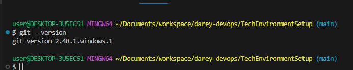
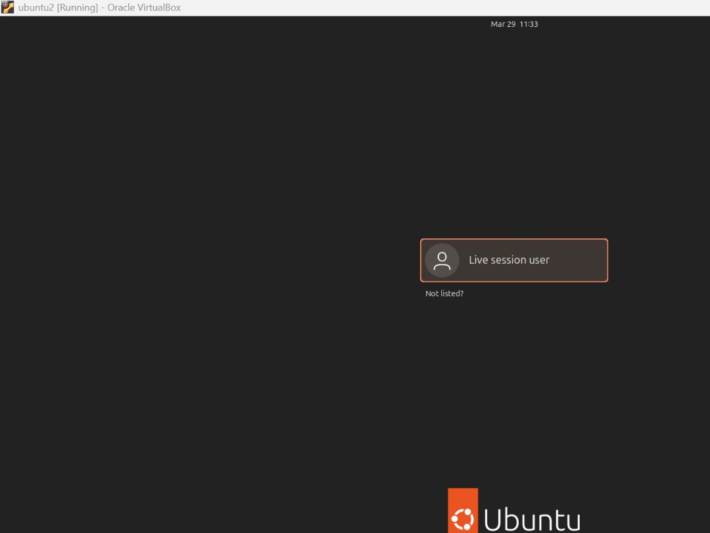

# Devops-Tech Environment Setup

## Introduction
This project involves setting up the environment, which includes installing essential tools and creating basic accounts.
## Visual Studio Code
I downloaded and installed Visual Studio Code on my Windows machine. 

## Git
I downloaded and installed git on my Windows machine. To verify git installation, I entered the following command git --version

## Virtual Box
I installed Virtual box on Windows and the screenshot below is the welcome page

## Ubuntu On Virtualbox
I downloaded Ubuntu 24.04 OS and installed it on a virtual machine in Virtual box and started the Virtual machine.

## Github Account
I created a github account using my email address

## Aws Account
 created a root user account on AWS and also created an IAM user and gave it administrative permissions
 

