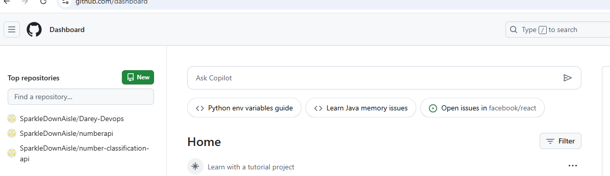
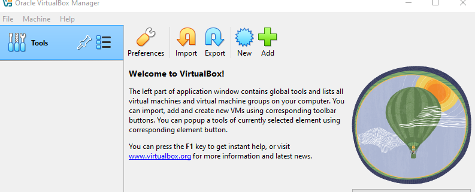
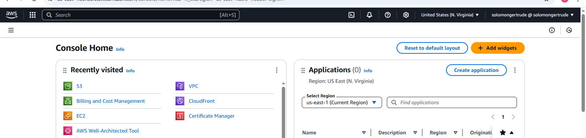

# Devops-Tech Environment Setup

## Introduction
This project involves setting up basic environment for DevOps.
# Tools Installed
## Visual Studio Code

## GitBash

## GitHub

## Virtual Box

## Aws 

